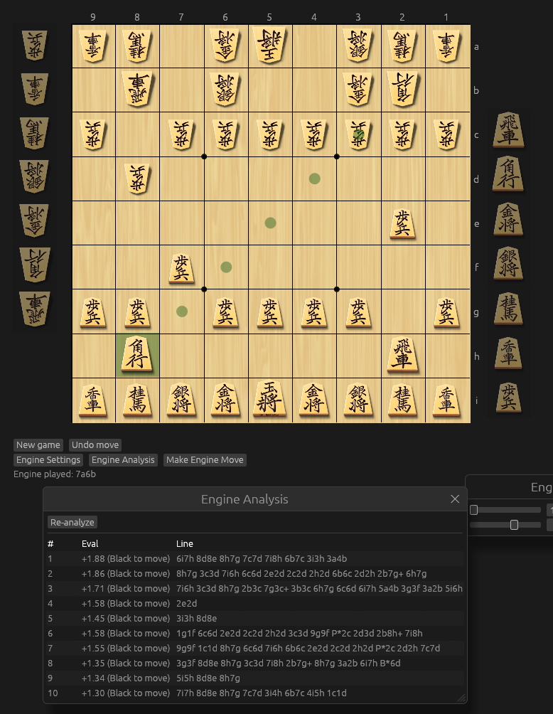
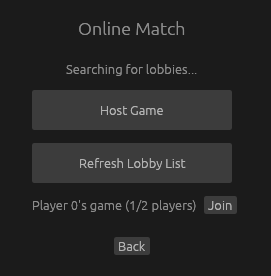
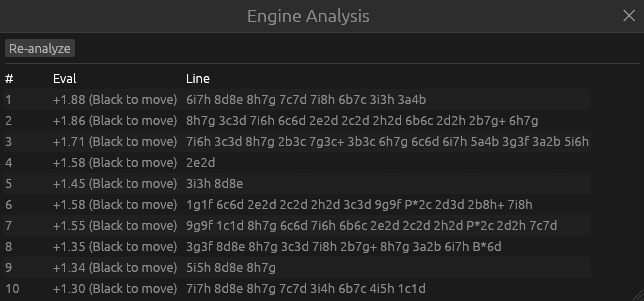
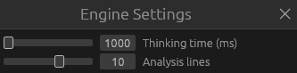

# ShogiSandbox
 
A cross-platform Shogi app in Rust with [YaneuraOu](https://github.com/yaneurao/yaneuraou) engine analysis, local AI opponent, and online multiplayer.



## Features
 
### Gameplay
- Legal move generation and highlighting, drops, promotion, checkmate, and repetition/perpetual-check detection
- Undo move / new game
- Full mouse support
- Limited gamepad support
### Online multiplayer
- Steam lobby browser: host a game, browse open lobbies, join by name
- Peer-to-peer, no dedicated server
- Turn-lock until opponent finishes their move
> Random matchmaking is in development. Currently you can only play with Steam friends.



### AI opponent & analysis
- Play against YaneuraOu (NNUE halfkp 256x2 32 32) with adjustable thinking time
- Engine analysis panel for different lines with eval score
- Move quality feedback on how good your moves were
- Sandbox mode for free play/analysis without an opponent
> Selecting a specific engine is in development.




## Setup
 
There is no bundled release yet. You could clone the repository, build from source, and join friends through Steam.
 
```bash
cargo build
cargo run
```